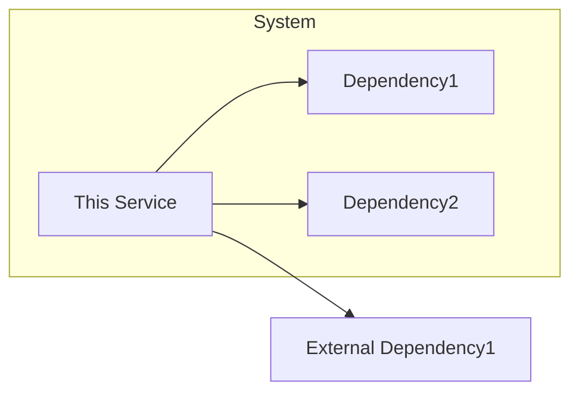
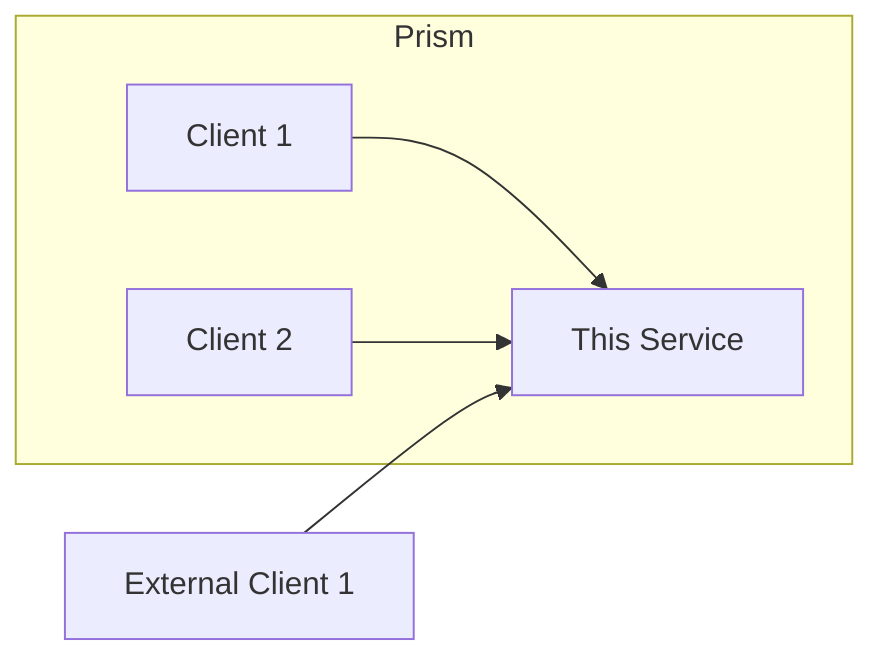

# Design

[High-level description of the service's architecture.]

## TOC
- [Dependencies](#dependencies)
  - [Dependency](#dependency)
- [Clients](#clients)
  - [Client](#client)
- Flows
  - [Flow](#flow) 
- [Decisions](#decisions)   

## Dependencies

[Diagram of the dependencies of the service]

### [Dependency]

[A detailed description of this service's dependence on another service, datastore, etc.]

[If Ahold Dependency, a URL to the Github code repository of the dependency]

Question that should be answered in this section:
- Why does my service depend upon this other service or datastore?
- What information does it need?
- What functionality of this service does the dependency support?
- If the dependency is unavailable, what happens to this service?
- Can this service function without the dependency?
  - If so, what does the functionality look like, alternative sources of data, empty responses, errors?
 

## Clients

[Diagram of the clients of the service]

### [Client]

[A detailed description of the clients of this service]

[If Ahold Client, a URL to the Github code repository of the client]

Questions that should be answered in this section:
- Why is the client using this service? 
- What information does the client need?
- What functionality of this client is this service supporting?
- Can the client function without this service?

## Decisions

[List of the links to architectural decision records (ADRs) for this service]

- [ADR](./adr.md)
