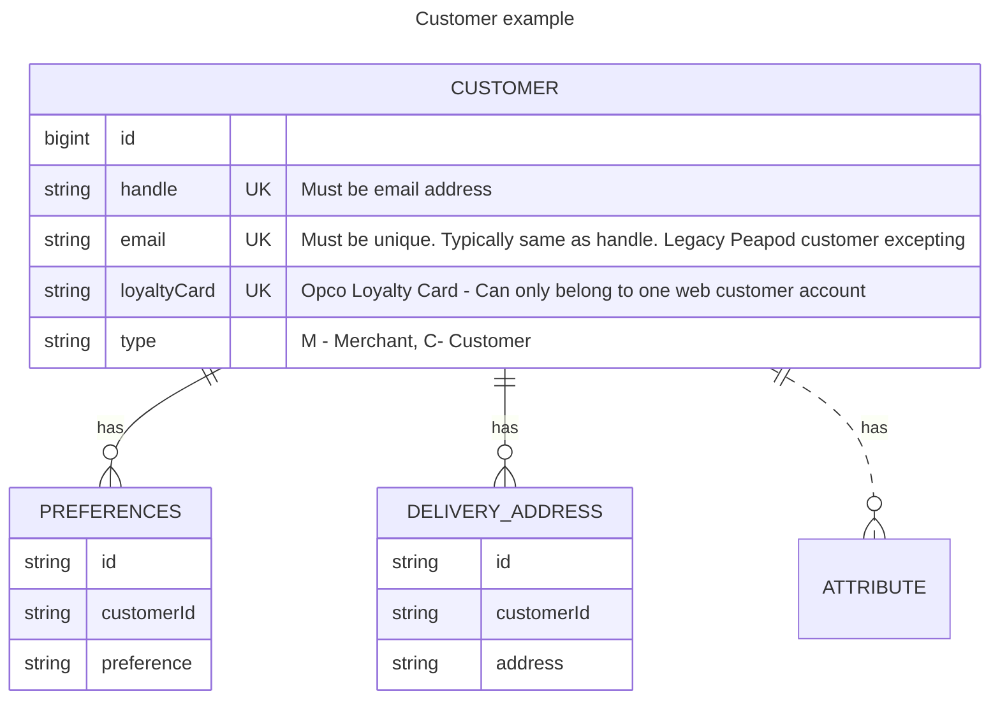
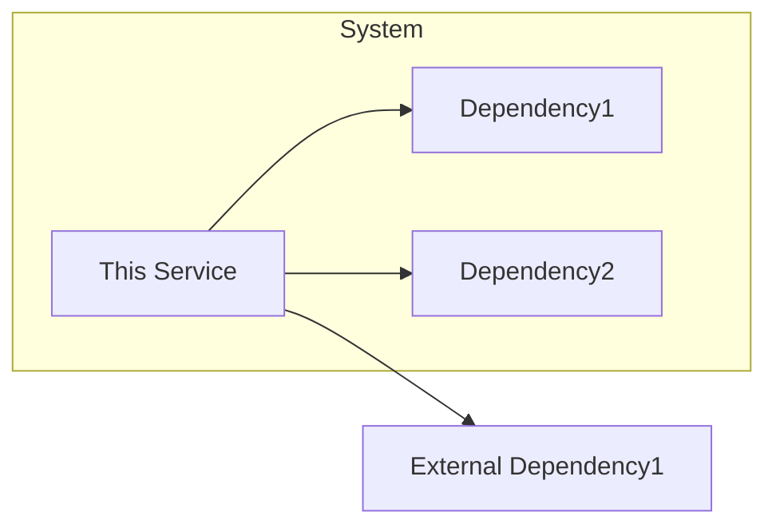
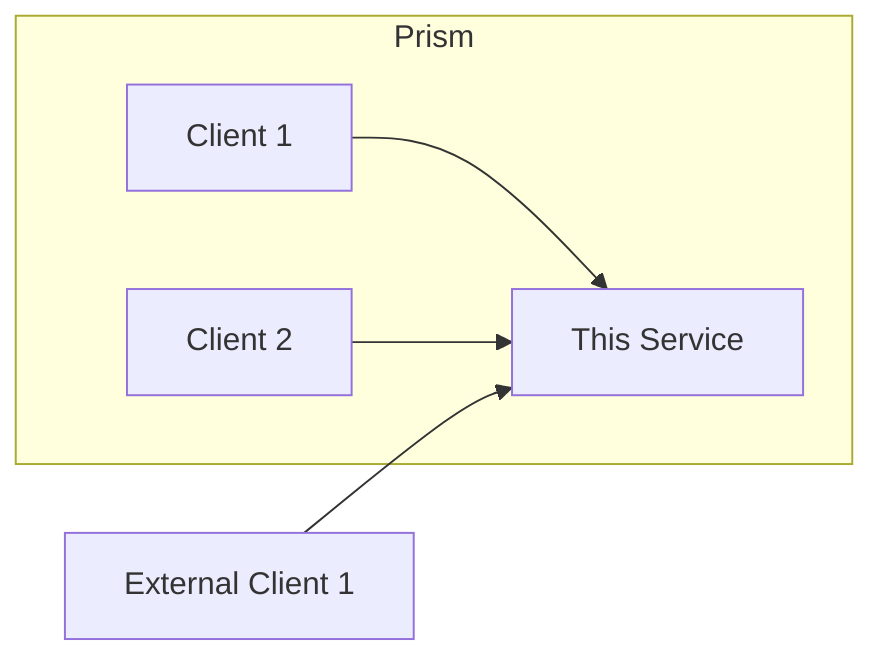

# Design

[High-level description of the service's architecture.]

## TOC
- [Technologies](#technologies)
- [Data](#data)
- [Security](#security)
- [Dependencies](#dependencies)
  - [Dependency](#dependency)
- [Clients](#clients)
  - [Client](#client)
- Flows
  - [Flow](#flow) 
- [Decisions](#decisions)   

### Technologies

[This section should contain a list of the technologies used in the service, e.g., Spring Boot, Kotlin, Hazelcast, etc.]

### Data (optional)

[This section should contain a description of the data model used in the service, e.g., ERD, UML, etc.]
[Questions to answer]
- What data does this service store and why?
- What are the relationships between the data elements?
- Any notes on data storage, e.g., encryption, hashing, etc.
- Any use of data caching or data replication?
- Any use of data partitioning or sharding?
- Any use of data archiving or data purging?
- Any dependence on data import jobs, triggers, or stored procedures?

### Security

[This section should contain a description of the security model used in the service, e.g., OAuth2, JWT, etc.]
[Questions to answer:]
1. Does this service have any security requirements?
2. Does this data use encryption at rest or in transit?
3. Deos this service store PII or PCI data?
   a. If so, how is it protected?
   b. Links to the data protection policy? 

## Dependencies

[Diagram of the dependencies of the service]

### [Dependency]

[A detailed description of this service's dependence on another service, datastore, etc.]

[If Ahold Dependency, a URL to the Github code repository of the dependency]

Question that should be answered in this section:
- Why does my service depend upon this other service or datastore?
- What information does it need?
- What functionality of this service does the dependency support?
- If the dependency is unavailable, what happens to this service?
- Can this service function without the dependency?
  - If so, what does the functionality look like, alternative sources of data, empty responses, errors?
 

## Clients

[Diagram of the clients of the service]

### [Client]

[A detailed description of the clients of this service]

[If Ahold Client, a URL to the Github code repository of the client]

Questions that should be answered in this section:
- Why is the client using this service? 
- What information does the client need?
- What functionality of this client is this service supporting?
- Can the client function without this service?

## Decisions

[List of the links to architectural decision records (ADRs) for this service]

- [ADR](./adr.md)
