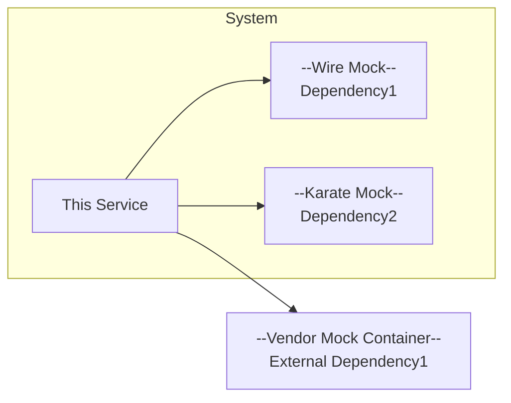

# Acceptance/Integration Testing

[Note: The integration tests within a Prism project is intended to be run as part of the build pipeline and use
a curated set of test data and mocks to validate the functionality of the service in isolation. The integration test 
suite contributes to the overall statement, branch, and line coverage results for the project and supplements the 
coverage of the project's unit tests. It is expected that if the integration test should fail, the build also fails.]


## TOC
- [Test Setup](#test-setup)
  - [Mocks](#mocks)
  - [Test Data](#test-data)
- [Pre-requisites](#pre-requisites) 
- [Running Test Cases](#running-test-cases)
- [Writing Test Cases](#writing-test-cases)
- [Test Code Coverage](#test-code-coverage)
- [Troubleshooting](#troubleshooting)

## Test Setup

[Describe the setup of the test environment, e.g., Docker containers, mocks, test data, etc.] 

[Provide a diagram, similar to the one in dependencies diagram in 
[architecture.md](../../docs/architecture.md#dependencies), that shows what test doubles are used for each of this service's
dependencies.]




### Mocks

[Describe each test mock used in the integration tests.]

[Questions to be answered in this section.]
- What are the conventions for naming test mocks in this project?
- How are the test mocks configured for tests, data files, configuration, etc.?
- How do I run each test mock standalone with the configuration needed for various tests?
- Links to the documentation for each test mock tech used in the integration tests, e.g, KarateLabs or WireMock


### Test Data

[Detailed description of the test data used in the integration tests]

[Questions to be answered in this section.]
- How is each test double configured for tests, data files, configuration, etc.?
- Any practices or conventions for naming test data files in this project? 
- If using PostgreSQL, provide a description of how the schema for the database is managed and test data loaded
  - Note: If using PostgreSQL with a schema versioning tool like Flyway, it is strongly suggested to use the Flyway files to create the database for integration test runs

## Prerequisites

[This section should detail any required software or configuration needed to run the integration tests, e.g., Docker desktop, Java, etc.]

[Please, provide details for each technology and any links to documentation on installation or setup.]


## Running Test Cases

[Describe how to run the integration suite and individual test cases.]

Example:
```bash
./gradlew integrationTest --test "some.package.name.TestClassName.testMethodName"
```

## Writing Test Cases

[This should provide a detailed description on curating data for the test cases, how to write the test cases, and how to run them.]

[This section can include]
- How to monitor network traffic of a running instance of the service to assist in collecting data for test cases
- Any tips on formatting data for use by a mock or a containerized service, e.g., using `jq` to format ElasticSearch query results into bulk load format. 
- Links to the any tools or libraries used in the integration tests, e.g., KarateLabs, WireMock, etc. 


## Test Code Coverage

[Description of the setup for code coverage in the integration tests. Example: Gradle, Jacoco, and SonarQube setup details.]

## Troubleshooting

[Notes on common issues encountered when running the integration tests and how to resolve them. 
Examples:]
- [Docker desktop tips for running a particular container on the mac vs the Intel chip ]
- [Environment variable setup]
- [Additional configuration needed for running the tests on a Windows machine]
 