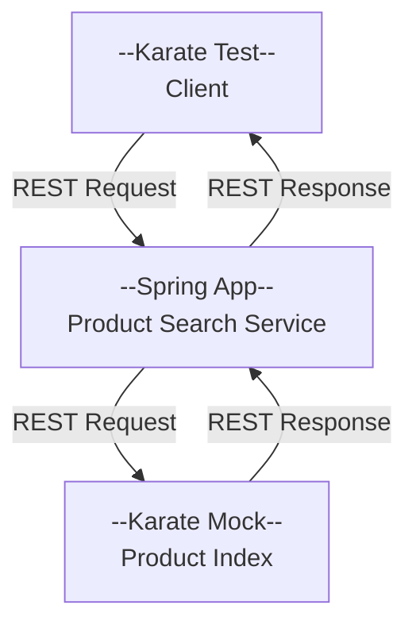

# Resilience4j and Integration Testing

## Introduction

Most Prism services are IO bound: taking a request; making calls to other services, databases, or external systems; 
and returning a response to the client. At any point, these IO operations can fail 
due to network issues, service issues, etc. Often these failures are transient but can be 
long enough that they result in a degraded customer experience or, in severe cases, a complete outage of 
the Prism website and/or mobile applications. Typically, Prism services have nothing in place to automatically deal 
with a prolonged outage or degraded performance from a downstream service, or the services use manual feature toggles. 
And, the time required for manual intervention can be long enough that the customer experience is significantly impacted by
the time the issue is addressed. Circuit breakers offer the ability to automatically deal with 
misbehaving or offline services and avoiding outage while alerting dev and support teams of a system problem.

This project is intended to provide an example and guidance on the use of Spring and
Resilience4j circuit-breaker. This includes:
1. Incorporation of the Resilience4j circuit-breaker into a Spring application
2. Configuration of Resilience4j circuit-breaker
3. Management of the circuit-breaker state via Spring actuator
 
> This guidance here is intended to be used in conjunction
> with the [Resilience4j documentation](https://resilience4j.readme.io/docs/getting-started).

## Project 

This project is a simple Spring Boot application that has a single ReST endpoint for finding products. This service calls
an endpoint provided by a product-index service, maps the returned data to a product-search result set, and returns the results to the client.



The project and its integration tests demonstrate the following:

1. Basic circuit-breaker configuration (count-based sliding windows, slow call duration, and error threshold)
2. Use of Resilience4j actuator endpoints to monitor circuit-breaker state and force the circuit breaker to open or close
3. Incorporation of the Resilience4j into the project without coupling the core components of the project to the Resilience4j
   library

> **Side Note:**
>
>  In addition to the use of Resilience4j, the project provides a basic example of the
> [clean architecture](https://blog.cleancoder.com/uncle-bob/2012/08/13/the-clean-architecture.html).
> This Spring IO talk [here](https://www.youtube.com/watch?v=mbNzUkNjrnA) provides a good overview of applying the ideas
> of clean architecture to a Spring-based application and was used as a guide for this project.


## Running the Application

### Running the Application Manually

1. **Start the Mock**
 
The product-index mock service can be started via Gradle to test new mocked endpoints or to test this project manually.

Example:
```bash
./gradlew runMockServer -PkarateMock="-m,src/intTest/resources/com/peapod/example/resilience/mocks/product-index.feature,-p,9300"
```

2. **Start the Spring Application**
 
Once the mock is running, you can run the Spring application from your IDE or via Gradle, just set the  
`PRODUCT_INDEX_URL` environment variable to the URL of the mock product-index server.


3. **Send Requests to the Service**
 
Once the Mock and app are up, you can begin sending requests to the service to either receive a successful response, cause
an error to be returned from the index, or a cause the index to take a long time to respond. This is all done with the 
request criteria sent by the client. 

  - `"text":"Error"` - causes the index to return an error
  - `"text":"Slow"`  - causes the index to return later than the configured slow call duration
  - `"text":"Product"` - returns a successful response

Below is an example of a request you can send to the service.

```bash
curl -X "POST" "http://localhost:8080/products/search" \
     -H 'Content-Type: application/json' \
     -d $'{
  "serviceLocationId": 1234,
  "text": "Error"
}'
```

### Running the Karate test cases

From your IDE, run the `ResilienceApplicationTest` JUnit tests. This will start the Spring application and run the Karate
tests.


### Dev Notes

### CircuitBreaker and Retries

Typically, Prism components are talking to other Prism components via ReST APIs using Spring RestTemplate, WebClient, Feign, etc.
All of these clients provide the ability to configure timeouts for connections and reads to ensure that a request does not hang indefinitely
and allows the service to fail fast. The Resilience4j CircuitBreaker can be used to handle timeouts (exceptions) and 
open according to configured thresholds.

While the Resilience4j Retry can be used in conjunction with the CircuitBreaker, it is recommended to return to the client
upon the first timeout or error. You will need to consider the performance requirements of your service endpoint and determine
if the additional latency of a retry is acceptable.

### Circuit Breakers and Fallback Functions

It is important to note that the fallback function is invoked on all exceptions that match the type of Throwable/Exception parameter
and not just when the circuit breaker is open (see https://resilience4j.readme.io/docs/getting-started-3#fallback-methods).
   
The following is an example of a fallback function that is invoked when any exception is thrown by the service being called.
```kotlin
    fun emptyResults(query: ProductSearchQuery, ex: Exception): ProductSearchResults {
        logger.error("${CIRCUIT_BREAKER_NAME} - Fallback to empty search results.")
        return ProductSearchResults(0, emptyList())
    }
```

### Monitoring and Control of Circuit Breakers

Resilience4j and Spring provide actuator endpoints that can be used to monitor and control the state of the circuit breakers.
(see [here for details](https://resilience4j.readme.io/docs/getting-started-3#metrics-endpoint)).

> **NOTE**: For these actuator endpoints to work, you'll need to have it configured.
> ```yaml
> management:
>   endpoints:
>      web:
>        exposure:
>            include: health,info,metrics,circuitbreakers
>```

#### Checking the Circuit Breaker State

In this service, the circuit breaker state(s) can be retrieved using `/actuator/circuitbreakers` endpoint. 
```zsh
curl -X GET http://localhost:8080/actuator/circuitbreakers | jq -c '.circuitBreakers.productApi.state' 
```
> This assumes you're running the example Spring app on port 8080.

#### Setting the Circuit Breaker State

The state of the circuit breaker can be controlled via an actuator endpoint for the specific circuit breaker, e.g.,
`/actuator/circuitbreakers/productApi`.

Example:
```zsh
curl -X "POST" "http://localhost:8080/actuator/circuitbreakers/productApi" \
     -H 'Content-Type: application/json' \
     -d $'{
          "updateState": "CLOSE"
        }'
```

The `updateState` value can be one of the following:
   - CLOSE
     - This closes the circuit breaker
     - If the breaker is currently in FORCED_OPEN or DISABLED state, forcing the beaker closed reactivates the automatic state transitions of the circuit breaker 
   - FORCE_OPEN
     - this transitions the circuit breaker to an open state
     - all calls will be blocked
     - The circuit breaker is effectively disabled and open, so it will not return to HALF_CLOSED state automatically
     - The circuit breaker will have to be set to CLOSE to resume normal operation 
   - DISABLE - this transitions the circuit breaker to a disabled state and all calls will be allowed through 

#### Circuit Breaker Metrics

The circuit breaker metrics can be retrieved via the `/actuator/metrics` endpoint. 

```zsh
curl -X "GET" "http://localhost:8080/actuator/metrics/resilience4j.circuitbreaker.calls"
```

See [Resilience4j Docs](https://github.com/RoyalAholdDelhaize/pdl-search-and-browser-user-coupon-service) for further details

#### Events Endpoints

```zsh
curl -X "GET" "http://localhost:8080/actuator/circuitbreakers"
```


## Sources
- [Resilience4j CircuitBreaker Docs](https://resilience4j.readme.io/docs/circuitbreaker)
- [Karate Labs Documentation](https://resilience4j.readme.io/docs/circuitbreaker)
- [Important Section to Understand Fallback Methods](https://resilience4j.readme.io/docs/getting-started-3#fallback-methods)
- [Circuit Breaker Health Endpoints](https://resilience4j.readme.io/docs/getting-started-3#health-endpoint)
